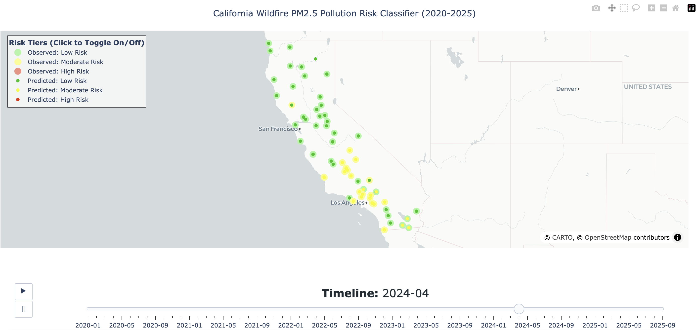

# California Wildfire PM2.5 Pollution Risk Classifier on Prison and Detention Facilities

## Project Overview 

The number and intensity of wildfires in California continue to increase, spreading into areas where they were once considered infrequent and now becoming a global phenomenon [^1]. Defined by the impacts of the climate crisis, the urgency to document and understand the increase in wildfire pollution events on frontline communities is necessary for climate-driven resource distribution and mitigation.

Drawing inspiration from Ufuoma Ovienmhada’s work with [The Toxic Prisons Mapping Project](https://www.toxicprisons.com/), this geospatial data science project focuses on creating a site-specific wildfire PM2.5 pollution risk classifier model for California prisons, conservation camps, and detention facilities over 5-years: January 2020 to September 2025. 

Pulling from various environmental datasets that provided contextual information about wildfire PM2.5 pollution surrounding the interested facilities, I created a Random Forest Regressor Derived Classifier and a Random Forest Classifier to understand how well a model could predict risk classification based on PM2.5 pollution and utilizing a three-risk category system. 

Outperforming the Random Forest Classifier, The Random Forest Regressor Derived Classifier

## Repository File Structure

```text
├── .gitignore  
├── README.md 
├── ca_wildfire_facilities_data_cleaning.ipynb  # Part 1: Cleaning and Finalizing Facilities Dataset
├── ca_wildfire_feature_engineering.ipynb       # Part 2: Feature Engineering
├── ca_wildfire_final_model.ipynb               # Part 4: Inputting into Models and Assessment
├── ca_wildfire_pre_analysis.ipynb              # Part 3: Pre-Analysis and Finalizing Features Before Inputting into Model
├── ca_wildfire_risk_tier_map.ipynb             # Part 5: Creating Risk Tier Map
```

## Code and Usage 

To run the code, fork this repository and read the Download Data and Key Research Outcome Sections. Information about where and how to download interested datasets and how to prioritize your own interested features for input are provided in the sections below.

## Download Data

This project uses data from various sources and contains a mix of downloaded, manually copy-pasted, and API requested data. Considering this project utilized various sources of data spanning a 5-year time period, some datasets exceeded the file size limits on GitHub. 

A simple list below is provided of the type of data utilized: 

Downloaded Data: 
CAL FIRE                                        # Wildfire geometries
NASA FIRMS 
EPA PM2.5 Daily Data 
California Department of Corrections and        # PDFs of Population Count
Rehabilitation Adult Facilities 

Manually Copy-Pasted Data: 
California Department of Corrections and        # List of Facility Names Copy-Pasted
Rehabilitation Adult Facilities 
TRAC Immigration                                # List of Monthly Population Data Copy-Pasted

API/GEE Data: 
 Purple Air                                                              
 NASA DEM                                       # Ran on Notebook -> GEE, then downloaded interested file
 NASA TROPOMI                                   # Ran on Notebook -> GEE, then downloaded interested file

To download the specified datasets, links are specified in their respective notebooks, mainly: 
```text
├── ca_wildfire_facilities_data_cleaning.ipynb  # Part 1: Cleaning and Finalizing Facilities Dataset
├── ca_wildfire_feature_engineering.ipynb       # Part 2: Feature Engineering
```

Personal data folder generally followed this file structure (Mostly for downloaded and manually copy-pasted data; contains some API requested downloaded data): 

```text
├── data 
|   ├── CDCR_MONTHLY_POP_2020_2025
|   |   ├── cdcr_pop_20[xx] (x 6)            # Folder created for each year (2020 -2025)
|   |   |   ├── Tpop1d200[xx].pdf (x 12)     # Monthly PDFs for each year were housed in this folder
|   |   |
|   ├── cdcr.txt
|   ├── cal_conservation_camps_address.xlsx
|   ├── cal_ice_detention_address.xlsx
|   ├── TRAC_IMMIGRATION_RECORDS_2020_2025.xlsx
|   ├── final_facilities_polygons.gpkg 
------------------------------------------------------------------------------------------------------ ^ Part 1 Relevant Datasets
|   ├── epa_pm_daily_summaries_202[x]_202[x] # Examined 2020 - 2025
|   |   ├── daily_pm_20[xx].csv (x6)         # Daily PM2.5 data per year 
|   ├── final_facilities_data.pkl
|   ├── California_Historic_Fire_Perimeters_586217350401785615.gpkg
|   ├── fire_archive_SV-C2_705647.csv
|   ├── NASA_Fire_Elevations_Final.csv       # (Created and downloaded via GEE)
|   ├── corrected_purpleair_data.csv         # (Downloaded after PurpleAir API Call)
|   ├── tropomi_co_no2_uvai.csv              # (Created and downloaded via GEE)
------------------------------------------------------------------------------------------------------ ^ Part 2 Relevant Datasets
```

## Key Research Outcomes 
1. Random Forest Regressor Derived Classifier Performed Better Than The Random Forest Classifier 
    - visualizations here - confusion matrix, auc, model accuracy, recall and precision

    a. Best for Site Specific Facilities and Three Risk Tier Categories

    b. Overly Cautious model

3. Combination of Localized and Regional Data 
    a. California Fire Perimeters
    b. PurpleAir Data

4. Features 

    - feature importance visualiztion
    - over time when creating features, population data essentially dropped / not as important


## Risk Tier Map
Creating a Risk Tier Map on Observed and Predicted Data + Classifications via Plotly: 



## Tech Stack


## References

[^1]: Sim, Hyeyoung, and Dong Yeong Chang. *Climate-Driven Wildfires: A Systematic Review of Prolongation, Spontaneity, and Scale with Lessons from California*, 17 Oct. 2025, https://doi.org/10.22541/essoar.176071959.91646747/v1. 