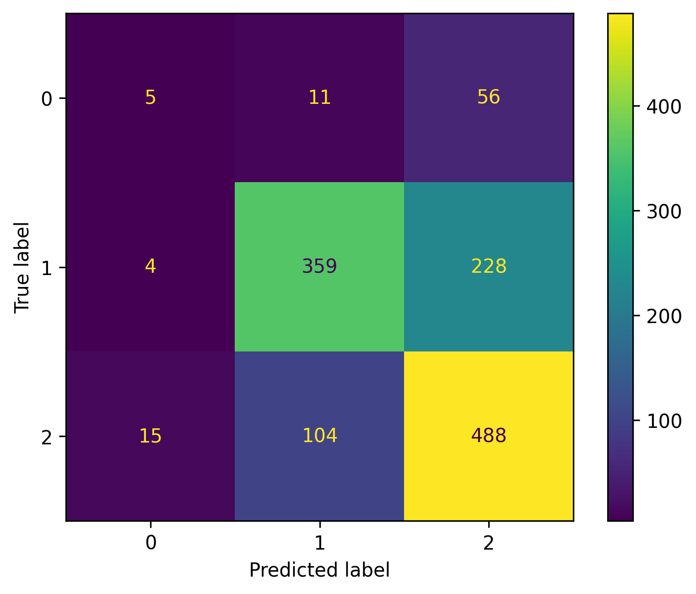
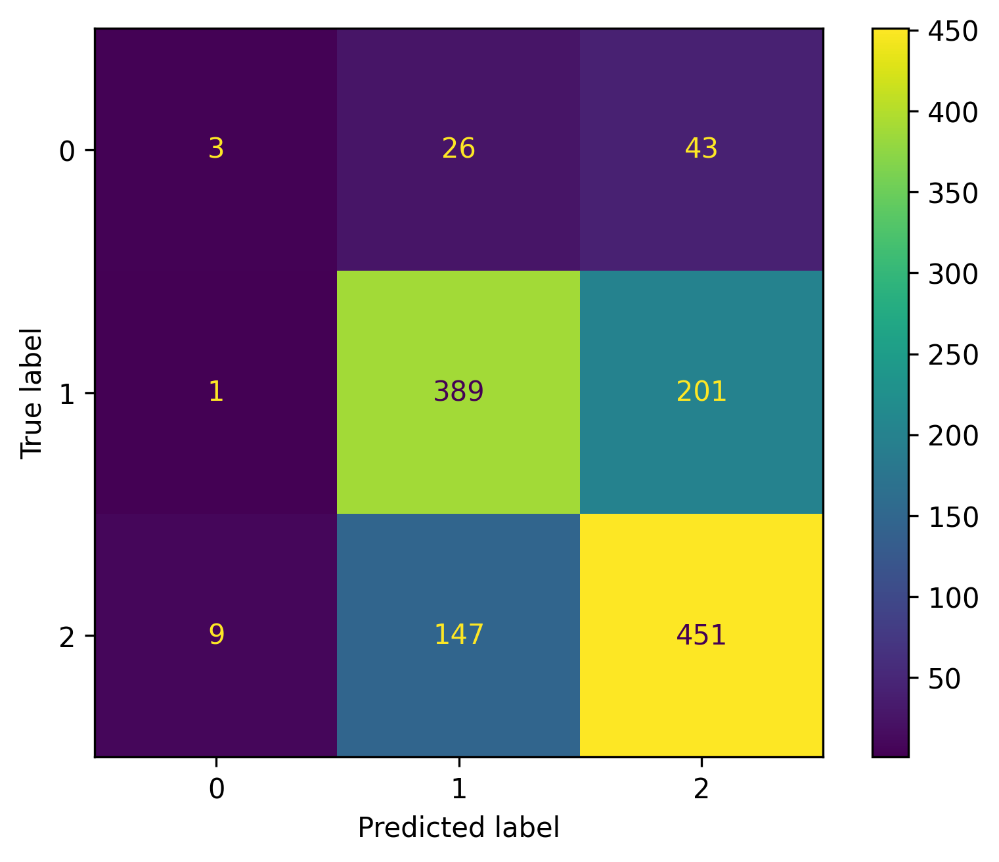
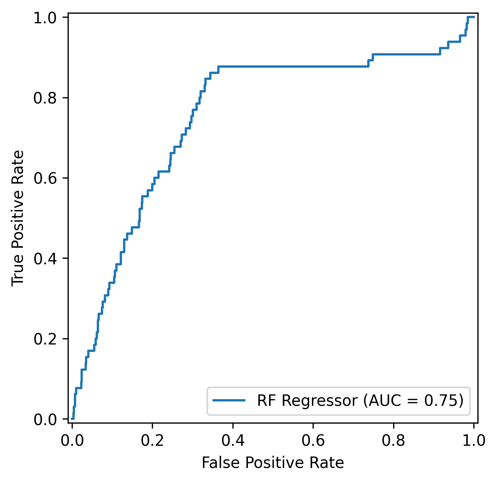
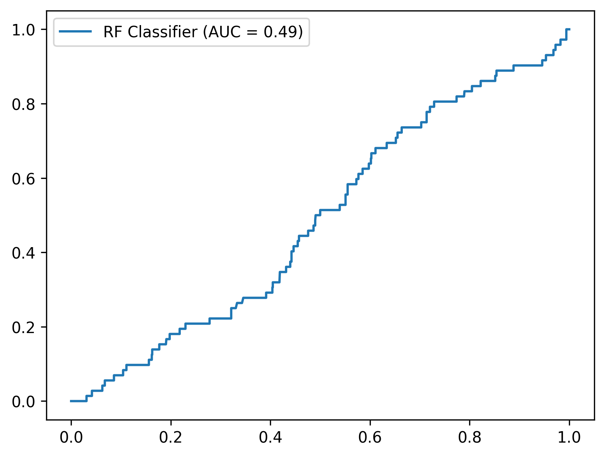
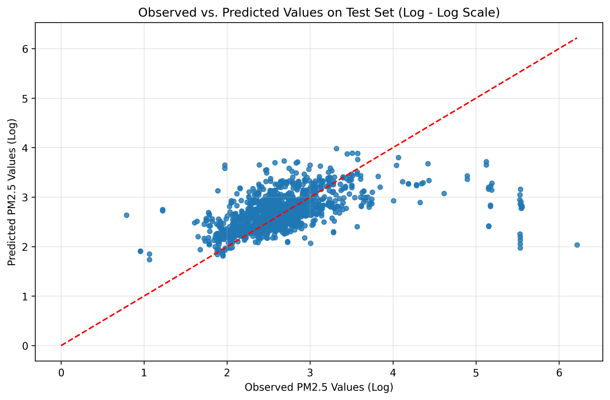
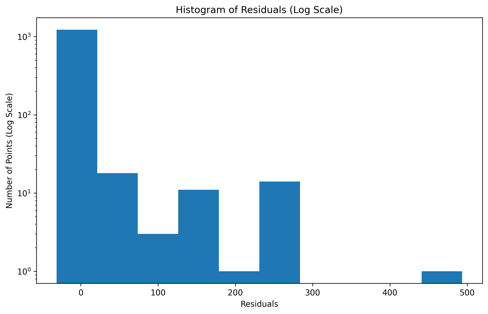
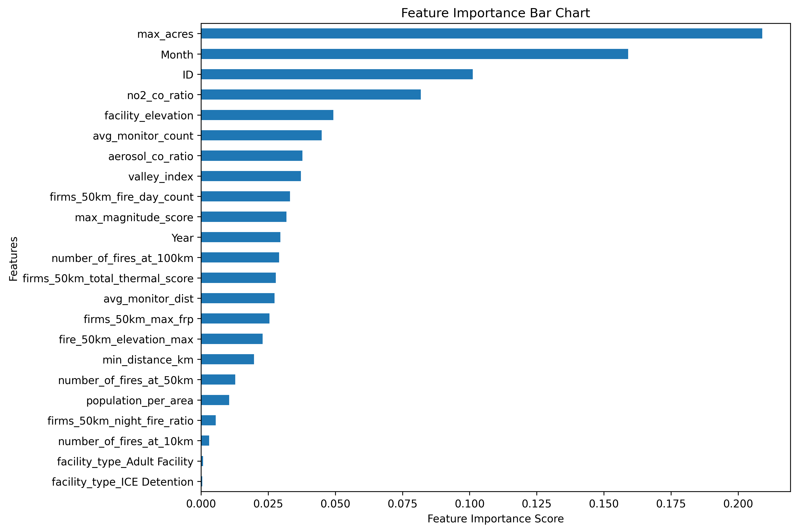
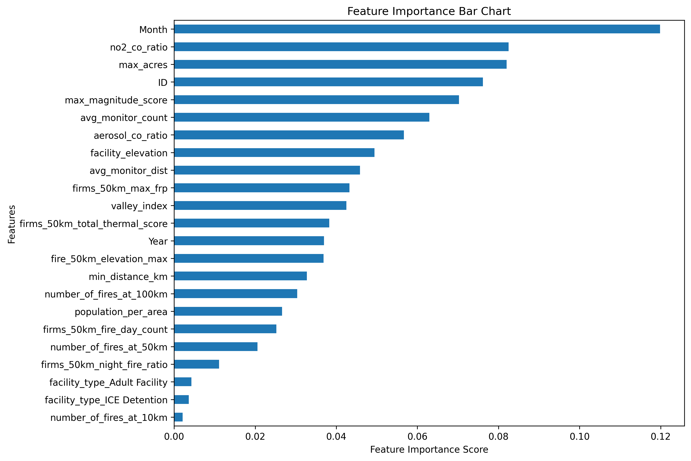

# California Wildfire PM2.5 Pollution Risk Classifier on Prison and Detention Facilities

## Project Overview 

The number and intensity of wildfires in California continue to increase, spreading into areas where they were once considered infrequent and now becoming a global phenomenon [^1]. Defined by the impacts of the climate crisis, the urgency to document and understand the increase in wildfire pollution events on frontline communities is necessary for climate-driven resource distribution and mitigation.

Drawing inspiration from Ufuoma Ovienmhada’s work with [The Toxic Prisons Mapping Project](https://www.toxicprisons.com/), this geospatial data science project focuses on creating a site-specific wildfire PM2.5 pollution risk classifier model for California prisons, conservation camps, and detention facilities over 5-years: January 2020 to September 2025. 

Pulling from various environmental datasets that provided contextual information about wildfire PM2.5 pollution surrounding the interested facilities, this project evaluates a Random Forest Regression-Based Classifier and a direct Random Forest Classifier to understand how well both models could predict risk classification into a three-risk system. 

Comparing classification-centered metrics, the Random Forest Regression-Based Classifier provides a robust prediction framework compared to the direct Random Forest Classifier. Although both models are conservative for high-risk predictions, the Random Forest Regression-Based Classifier was trained on the raw PM2.5 values, preserving the granularity to make predictions and scoring a value of 0.75 on the ROC-AUC Curve. 

## Repository File Structure

```text
├── docs/
│   └── index.html
├── visualizations/
│   ├── reg_confusion_matrix.png
│   ├── classifier_confusion_matrix.png
│   ├── reg_roc.png
│   └── ... (all other PNGs)
├── .gitignore  
├── README.md 
├── ca_wildfire_facilities_data_cleaning.ipynb  # Part 1: Cleaning and Finalizing Facilities Dataset
├── ca_wildfire_feature_engineering.ipynb       # Part 2: Feature Engineering
├── ca_wildfire_final_model.ipynb               # Part 4: Inputting into Models and Assessment
├── ca_wildfire_pre_analysis.ipynb              # Part 3: Pre-Analysis and Finalizing Features Before Inputting into Model
├── ca_wildfire_risk_tier_map.ipynb             # Part 5: Creating Risk Tier Map
```

## Code and Usage 

To run the code, fork this repository and read the Download Data and Key Research Outcome Sections. Information about where and how to download interested datasets and how to prioritize your own interested features are provided in the sections below.

## Download Data

This project uses data from various sources and contains a mix of downloaded, manually copy-pasted, and API requested data. Considering this project utilized various sources of data spanning a 5-year time period, some datasets exceeded the file size limits on GitHub. 

A simple list below is provided of the type of data utilized: 

* Downloaded Data: 
  * CAL FIRE (Wildfire geometries)
  * NASA FIRMS 
  * EPA PM2.5 Daily Data 
  * California Department of Corrections and Rehabilitation Adult Facilities (PDFs of Population Count)
   
* Manually Copy-Pasted Data: 
  * California Department of Corrections and Rehabilitation Adult Facilities (List of Facility Names Copy-Pasted)
  * TRAC Immigration (List of Monthly Population Data Copy-Pasted)

* API/GEE Data: 
  * Purple Air                                     
  * NASA DEM (Ran on Notebook -> GEE, then downloaded interested file)
  * NASA TROPOMI (Ran on Notebook -> GEE, then downloaded interested file)

To download the specified datasets, links are specified in their respective notebooks, mainly in: 
```text
├── ca_wildfire_facilities_data_cleaning.ipynb  # Part 1: Cleaning and Finalizing Facilities Dataset
├── ca_wildfire_feature_engineering.ipynb       # Part 2: Feature Engineering
```

Personal data folder generally followed this file structure (Mostly for downloaded and manually copy-pasted data; contains some API requested downloaded data): 

```text
├── data 
|   ├── CDCR_MONTHLY_POP_2020_2025
|   |   ├── cdcr_pop_20[xx] (x 6)            # Folder created for each year (2020 -2025)
|   |   |   ├── Tpop1d200[xx].pdf (x 12)     # Monthly PDFs for each year were housed in this folder
|   |   |
|   ├── cdcr.txt
|   ├── cal_conservation_camps_address.xlsx
|   ├── cal_ice_detention_address.xlsx
|   ├── TRAC_IMMIGRATION_RECORDS_2020_2025.xlsx
|   ├── final_facilities_polygons.gpkg 
------------------------------------------------------------------------------------------------------ ^ Part 1 Relevant Datasets
|   ├── epa_pm_daily_summaries_202[x]_202[x] # Examined 2020 - 2025
|   |   ├── daily_pm_20[xx].csv (x6)         # Daily PM2.5 data per year 
|   ├── final_facilities_data.pkl
|   ├── California_Historic_Fire_Perimeters_586217350401785615.gpkg
|   ├── fire_archive_SV-C2_705647.csv
|   ├── NASA_Fire_Elevations_Final.csv       # (Created and downloaded via GEE)
|   ├── corrected_purpleair_data.csv         # (Downloaded after PurpleAir API Call)
|   ├── tropomi_co_no2_uvai.csv              # (Created and downloaded via GEE)
------------------------------------------------------------------------------------------------------ ^ Part 2 Relevant Datasets
```

## Key Research Outcomes 
### 1. Random Forest Regression-Based Classifier vs. Direct Random Forest Classifier
A comparative analysis was done between both models, examining classification reports, confusion matrices and a ROC-AUC Curve. 

While both models utilized a three-risk tier system, the RF Regression-Based Classifier model achieved higher precision in Low-Risk and higher recall for Moderate-Risk Categories compared to the direct RF Classifier.

#### Confusion Matrix
| RF Regression-Based Classifier | RF Direct Classifier |
| :---: | :---: |
|  |  |

Moreover, the direct RF Classifier had an AUC value of 0.49, suggesting that the model performed no better than random chance. In contrast, the RF Regression-Based Classifier achieved an AUC value of 0.75, revealing that inputting the raw continuous PM2.5 values maintains the detail for precise risk-tier mapping.

#### ROC-AUC Curves
| RF Regression-Based Classifier | RF Direct Classifier |
| :---: | :---: |
|  |  |

### 2. Model Conservation and Underprediction
Analyzing both models revealed conservative predictions, where extreme values (High-Risk Categories) were underpredicted. 

The Observed Vs. Predicted Scatter Plot for the RF Regression-Based Classifier below illustrates predicted values never exceed a value of Log 4. As observed values exeed a value of Log 4, predicted values start to decline and hit a minimum of value of Log 2.

#### RF Regression-Based Classifier Observed Vs. Predicted Values Scatter Plot
 

Additionally, the histograms of the residuals below demonstrates a right-skewed, validating the model's underpredictions for high values. 

#### RF Regression-Based Classifier Right-Skewed Histogram
 

### 3. Localized vs. Regional Data Inconsistencies
Both model's performance were impacted by localized and regional data inconsistencies. 

#### CAL FIRE Dataset
The CAL FIRE wildfire perimeters dataset only records fire perimeters that meet a specific criteria (e.g., ≥10 acres in timber, ≥300 in grass), omitting information on smaller and localized fires. This omission meant that localized PM2.5 data lacked a corresponding fire perimeter feature, leading to an increase in site-specific predictions. 

#### Purple Air Outliers
While the majority of the PM2.5 data was obtained from the EPA daily data website (aggregated monthly), a 50km proximity filter revealed missing coverage for rural facilities. To resolve this, PurpleAir sensor data was integrated. 

However, the PurpleAir raw `pm_cf_1` values occasionally exceeded values 500 μg/m³ and reached values up to 2500 μg/m³. Initially, these outliers were uncaught, and resulted in high MSE and RMSE values for the RF Regression-Based Classifier. By implementing a 500 μg/m cap, before standardizing, the model's loss functions were minimized. Nevertheless, the right-skewed residuals histogram still shows the high values of these localized events.

### 4. Feature Importance Prioritization
Although both models differed in their ROC-AUC Curve values, their feature importance metrics aligned similarily.

Both models prioritized max_acres, month, and no2_co_ratio features. The high ranking of the `ID` feature and month represents that risk is dependent on specific site and seasonal events. 

Other features, such as facility type and population_per_area features provided insignificant information for the models. For future applications, the feature importance visalizations below can serve as a guideline for feature selection, and emphasizes the importance on focusing on environmental variables. 

| RF Regression-Based Classifier | RF Direct Classifier |
| :---: | :---: |
|  |  

## Risk Tier Map
The following map visualizes the interested facilities observed risk-tiers and RF Regression-Based Classifier model's performance on test and missing data via Plotly.


**[View The Interactive Risk-Tier Map](https://allisonsibrian.github.io/ca-wildfire-pollution-prison-project/)**  
> *Features include hover-data for PM2.5 concentrations and observed and predicted risk-tiers.*

## Tech Stack
*   **Data Processing & Geospatial Analysis:** `pandas`, `geopandas`, `Google Earth Engine`, `QGIS`
*   **Machine Learning:** `scikit-learn` (Random Forest Regressor/Classifier, TimeSeriesSplit).
*   **Visualizations:** `matplotlib`, `seaborns`, `Plotly` 
*   **AI Usage**: `Google Gemini` (Utilized to consolidate datasets between GEE, identifying high loss function errors, optimizing Plotly HTML layouts, and refining documentation structure.)

## Contact Information
Email: allisonnsibrian@gmail.com


## References 
[^1]: Sim, Hyeyoung, and Dong Yeong Chang. *Climate-Driven Wildfires: A Systematic Review of Prolongation, Spontaneity, and Scale with Lessons from California*, 17 Oct. 2025, https://doi.org/10.22541/essoar.176071959.91646747/v1. 